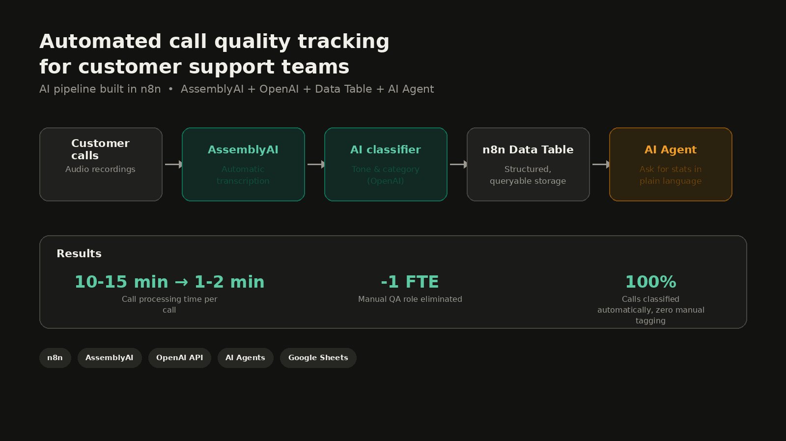
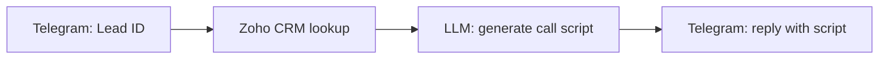

# n8n Telegram Call Script Bot
> Send a Lead ID in Telegram, get an AI-generated call script built from live Zoho CRM data.

## Problem
Sales reps waste time before every call digging through CRM records and
guessing what to say. Scripts written once become outdated as soon as a
lead's data changes in the CRM.

## Solution
A Telegram bot built on n8n: the rep sends a Lead ID, the workflow pulls
the lead's current data from Zoho CRM, and an LLM generates a ready-to-use
call script tailored to that lead — delivered back in the same chat within
seconds.

## How it works

## Tech stack
n8n | Telegram Bot API | Zoho CRM | OpenAI

## Author
Andrii Shevchuk, AI Automation Engineer | n8n & AI Agents
[LinkedIn](https://www.linkedin.com/in/sh-dev-a-ai/) · [Upwork](https://www.upwork.com/freelancers/~01c28bbcb1e0c08170?mp_source=share) · [Portfolio](https://jasper-spur-64b.notion.site/Andrea-Shevchuk-3746e46a716e80ae90e0f73434dbfb92?source=copy_link)

## License
MIT
